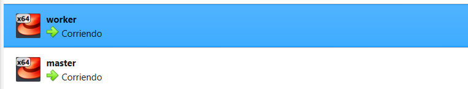
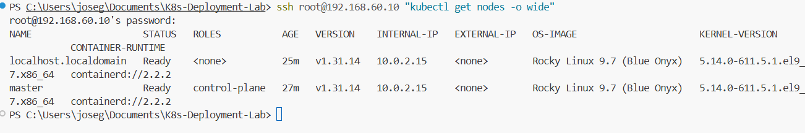
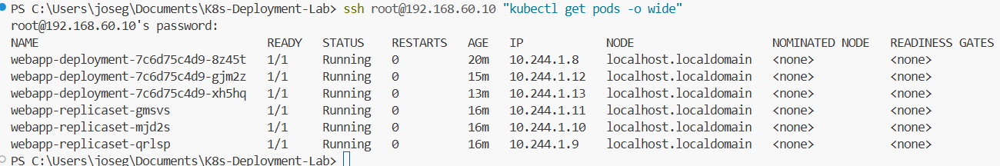
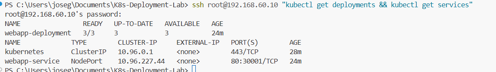
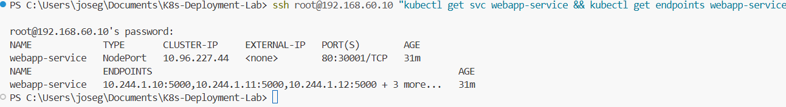
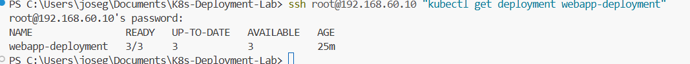
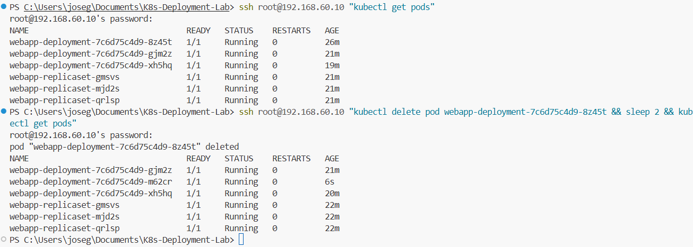
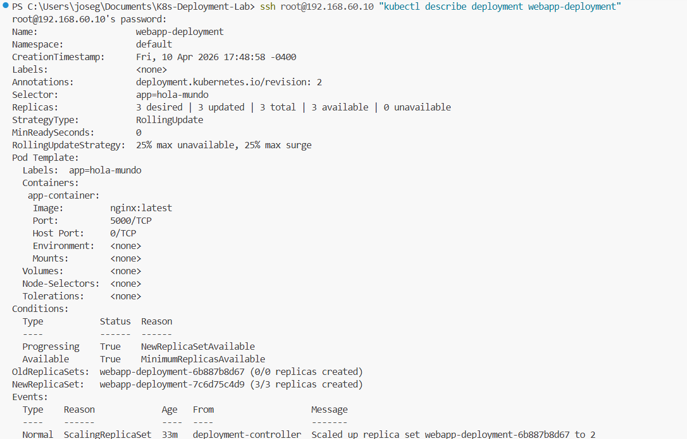
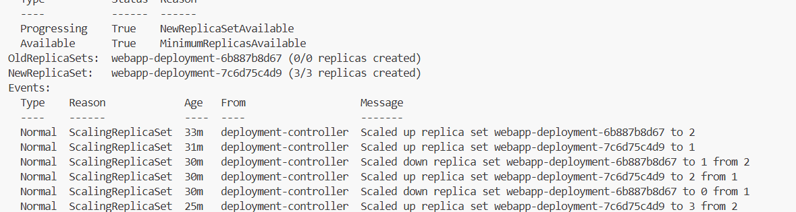

# Informe de Laboratorio: Despliegue de Aplicaciones en Kubernetes

**Estudiante:** Jose Fernando Guerrero Mosquera  
**Código:** A00365253  
**Asignatura:** Infraestructura III  
**Universidad:** ICESI  
**Modalidad:** Individual  
**Entorno:** Clúster kubeadm sobre VirtualBox  
**Fecha:** Abril 2026

---

## Tabla de Contenidos

1. [Introducción](#introducción)
2. [Objetivos](#objetivos)
3. [Planteamiento del Problema](#planteamiento-del-problema)
4. [Justificación](#justificación)
5. [Marco Teórico](#marco-teórico)
6. [Materiales](#materiales)
7. [Desarrollo del Proyecto](#desarrollo-del-proyecto)
8. [Análisis del Desarrollo](#análisis-del-desarrollo)
9. [Dificultades Encontradas](#dificultades-encontradas)
10. [Conclusiones](#conclusiones)
11. [Anexo: Guía de Reproducibilidad](#anexo-guía-de-reproducibilidad)

---

## Introducción

La orquestación de contenedores representa uno de los pilares fundamentales de la infraestructura moderna de software. En entornos productivos actuales, las aplicaciones se despliegan como conjuntos de microservicios contenerizados que deben escalar, recuperarse de fallos y actualizarse sin interrumpir el servicio. Kubernetes se ha consolidado como el estándar de facto para gestionar este tipo de infraestructura.

Este laboratorio aborda el despliegue real de aplicaciones contenerizadas sobre un clúster Kubernetes construido manualmente con **kubeadm** sobre máquinas virtuales en VirtualBox. A diferencia de entornos gestionados como EKS o GKE, donde el proveedor abstrae la complejidad del plano de control, este entorno exige al estudiante comprender y resolver cada capa del sistema: desde la configuración de red entre nodos hasta la inicialización del clúster y el despliegue de aplicaciones mediante manifiestos YAML.

A lo largo de la práctica se ejecutaron las fases de preparación del clúster, análisis de manifiestos, despliegue, exposición de servicios, escalamiento horizontal y prueba de resiliencia, documentando cada etapa con evidencia técnica.

---

## Objetivos

### Objetivo General

Desplegar, exponer y gestionar aplicaciones contenerizadas en un clúster Kubernetes real construido manualmente con kubeadm sobre VirtualBox, comprendiendo su comportamiento operativo y los mecanismos internos de orquestación.

### Objetivos Específicos

- Construir un clúster Kubernetes funcional de dos nodos usando kubeadm sobre Rocky Linux 9 en VirtualBox.
- Interpretar y aplicar manifiestos YAML para desplegar recursos de tipo Deployment, ReplicaSet y Service.
- Validar el estado del clúster y de las aplicaciones mediante el uso de `kubectl`.
- Demostrar el comportamiento de auto-recuperación (self-healing) de Kubernetes ante la eliminación manual de pods.
- Escalar aplicaciones horizontalmente modificando el número de réplicas de un Deployment.
- Exponer servicios usando el tipo NodePort para acceso externo al clúster.

---

## Planteamiento del Problema

Las organizaciones que adoptan arquitecturas basadas en contenedores enfrentan el desafío de gestionar el ciclo de vida de múltiples servicios de forma confiable, escalable y eficiente. Crear pods de forma individual no garantiza disponibilidad continua: si un pod falla, no existe ningún mecanismo que lo restaure automáticamente.

El problema central de este laboratorio es: **¿Cómo desplegar, exponer y gestionar aplicaciones contenerizadas en un clúster Kubernetes real, garantizando alta disponibilidad, escalabilidad y resiliencia ante fallos?**

Adicionalmente, el entorno kubeadm sobre VirtualBox introduce complejidades reales de infraestructura que no existen en entornos gestionados: configuración manual de la red entre nodos, resolución de nombres, gestión del runtime de contenedores y configuración del plano de control.

---

## Justificación

El uso de kubeadm sobre VirtualBox, en lugar de un servicio gestionado, se justifica por las siguientes razones:

**Aprendizaje profundo:** Al construir el clúster manualmente, el estudiante interactúa directamente con cada componente del sistema (etcd, API server, kubelet, kube-proxy, CNI), desarrollando una comprensión que no es posible en entornos donde estos componentes están ocultos.

**Cercanía a entornos reales:** Las empresas que despliegan Kubernetes on-premise (centros de datos propios, entornos híbridos) utilizan herramientas como kubeadm. La experiencia adquirida es directamente aplicable a estos escenarios.

**Resolución de problemas reales:** Los errores encontrados durante la práctica (configuración de red, permisos SSH, sincronización de tiempo, imágenes de contenedor) son representativos de los problemas que enfrenta un ingeniero de infraestructura en producción.

---

## Marco Teórico

### Kubernetes

Kubernetes es un sistema de orquestación de contenedores de código abierto desarrollado originalmente por Google. Automatiza el despliegue, escalamiento y gestión de aplicaciones contenerizadas. Su arquitectura se divide en dos planos:

- **Control Plane (master):** Contiene el API server, etcd, el scheduler y el controller manager. Es responsable de mantener el estado deseado del clúster.
- **Worker Nodes:** Ejecutan los pods. Cada nodo tiene un kubelet (agente), kube-proxy (networking) y el runtime de contenedores.

### kubeadm

Herramienta oficial para inicializar clústeres Kubernetes en entornos bare-metal o VMs. Automatiza la generación de certificados, configuración del API server y unión de nodos mediante el comando `kubeadm join`.

### Pod

La unidad mínima de despliegue en Kubernetes. Contiene uno o más contenedores que comparten red y almacenamiento. Un pod creado directamente no tiene controlador — si falla, no se recrea.

### Deployment

Objeto de Kubernetes que gestiona el ciclo de vida de los pods a través de un ReplicaSet. Define el estado deseado (imagen, réplicas, variables de entorno) y el controlador lo reconcilia continuamente con el estado real. Habilita rolling updates, rollback y escalamiento.

### ReplicaSet

Controlador que garantiza que un número específico de réplicas de un pod estén corriendo en todo momento. Es el responsable directo del self-healing: cuando detecta que el número de pods activos es menor al deseado, crea nuevos pods automáticamente.

### Service

Abstracción que expone un conjunto de pods con una IP y nombre DNS estables. Los tipos relevantes son:

| Tipo | Descripción |
|---|---|
| ClusterIP | Solo accesible dentro del clúster |
| NodePort | Expone un puerto en cada nodo (rango 30000-32767) |
| LoadBalancer | Requiere balanceador externo (MetalLB en on-premise) |

### Flannel

Plugin CNI (Container Network Interface) que provee la red overlay entre pods de distintos nodos. Permite que pods en diferentes workers se comuniquen usando IPs virtuales.

### Self-Healing

Mecanismo por el cual Kubernetes detecta y corrige divergencias entre el estado deseado y el estado real. El ReplicaSet ejecuta un loop de reconciliación continuo: si un pod es eliminado o falla, crea uno nuevo para mantener el número de réplicas configurado.

---

## Materiales

### Hardware y Virtualización

| Componente | Detalle |
|---|---|
| Host | Windows 11 Home, procesador x86_64 |
| Hypervisor | Oracle VirtualBox 7.2.6 |
| VM Master | Rocky Linux 9.7, 2 vCPU, 2 GB RAM |
| VM Worker | Rocky Linux 9.7, 2 vCPU, 2 GB RAM |

### Red — Interfaces configuradas

| Interfaz VirtualBox | Tipo | IP Host (Windows) | IP Master | IP Worker |
|---|---|---|---|---|
| NIC 1 | NAT | — | 10.0.2.15 | 10.0.2.15 |
| NIC 3 | Host-Only #3 | 192.168.60.1 | 192.168.60.10 | 192.168.60.11 |
| NIC 4 | Internal (k8s-int) | — | 10.10.10.1 | 10.10.10.2 |

> La red `k8s-int` (10.10.10.0/24) se usó como red de comunicación del clúster. La red Host-Only (192.168.60.0/24) se usó para acceso SSH desde el host.

### Software

| Software | Versión |
|---|---|
| Rocky Linux | 9.7 (Blue Onyx) |
| containerd | 2.2.2 |
| kubeadm / kubelet / kubectl | 1.31.14 |
| Flannel CNI | v0.26.7 |
| VS Code | — |

### Repositorio de aplicaciones

```
https://github.com/mariocr73/K8S-apps.git
```

---

## Desarrollo del Proyecto

### Fase 1 — Preparación del entorno

Se partió de dos máquinas virtuales en VirtualBox con Rocky Linux 9.7 instalado. Ninguna tenía Kubernetes configurado. Se estableció conectividad SSH desde el host Windows hacia ambas VMs mediante la interfaz Host-Only:

- Master: `192.168.60.10`
- Worker: `192.168.60.11`



*Figura 1: Acceso SSH establecido al nodo master (192.168.60.10) desde la terminal de VS Code en Windows.*

Se sincronizó el reloj del sistema en ambas VMs para resolver errores de certificados SSL durante la instalación de paquetes:

```bash
timedatectl set-ntp true
chronyc makestep
```



*Figura 2: Estado de los nodos del clúster. Ambos nodos en estado Ready confirman que el control plane y el worker están operativos. El worker aparece como `localhost.localdomain` debido a que el hostname de la VM no fue personalizado durante la instalación del SO, lo cual no afecta el funcionamiento del clúster.*

### Fase 2 — Instalación de Kubernetes en el master

Se instalaron y configuraron los componentes necesarios:

```bash
# Deshabilitar swap (requerido por Kubernetes)
swapoff -a
sed -i '/swap/d' /etc/fstab

# Módulos del kernel requeridos
modprobe overlay
modprobe br_netfilter

# Instalar containerd como runtime
dnf install -y containerd.io
sed -i 's/SystemdCgroup = false/SystemdCgroup = true/' /etc/containerd/config.toml
systemctl enable --now containerd

# Instalar kubeadm, kubelet, kubectl v1.31
dnf install -y kubelet kubeadm kubectl
systemctl enable kubelet
```

### Fase 3 — Inicialización del clúster

Se asignó IP estática a la interfaz de red interna `k8s-int` en el master:

```bash
ip addr add 10.10.10.1/24 dev enp0s10
ip link set enp0s10 up
```

Se inicializó el clúster usando esa IP como dirección del API server:

```bash
kubeadm init \
  --pod-network-cidr=10.244.0.0/16 \
  --apiserver-advertise-address=10.10.10.1
```

Se configuró kubectl para el usuario root:

```bash
mkdir -p /root/.kube
cp /etc/kubernetes/admin.conf /root/.kube/config
```

Se instaló el plugin de red Flannel:

```bash
kubectl apply -f https://github.com/flannel-io/flannel/releases/latest/download/kube-flannel.yml
```

### Fase 4 — Unión del nodo worker

En el worker se instalaron los mismos prerequisitos (containerd, kubeadm, kubelet) y se asignó IP a la interfaz k8s-int:

```bash
ip addr add 10.10.10.2/24 dev enp0s10
ip link set enp0s10 up
```

Se ejecutó el comando de unión generado por kubeadm init:

```bash
kubeadm join 10.10.10.1:6443 --token <token> \
  --discovery-token-ca-cert-hash sha256:<hash>
```

### Fase 5 — Despliegue de la aplicación

Se clonó el repositorio con los manifiestos YAML y se desplegaron:

```bash
git clone https://github.com/mariocr73/K8S-apps.git
kubectl apply -f K8S-apps/ --recursive
```

Los manifiestos definían los siguientes recursos:

| Recurso | Nombre | Descripción |
|---|---|---|
| Deployment | webapp-deployment | 2 réplicas de la webapp |
| ReplicaSet | webapp-replicaset | 3 pods adicionales |
| Service | webapp-service | NodePort en puerto 30001 |
| ConfigMap | webapp-configmap | Configuración de la app |

La imagen original era un placeholder. Se reemplazó con `nginx:latest`:

```bash
kubectl set image deployment/webapp-deployment app-container=nginx:latest
```



*Figura 3: Pods en estado Running tras aplicar los manifiestos YAML. Se observan los pods del Deployment y del ReplicaSet activos en el worker.*



*Figura 4: Deployment disponible y Service tipo NodePort exponiendo la aplicación en el puerto 30001.*



*Figura 5: Service tipo NodePort activo con 6 endpoints registrados, correspondientes a los pods del Deployment y ReplicaSet en estado Running. Confirma que el Service enruta tráfico correctamente hacia los pods.*

### Fase 6 — Escalamiento

Se escaló el Deployment a 3 réplicas:

```bash
kubectl scale deployment webapp-deployment --replicas=3
```

Resultado verificado:

```
NAME                READY   UP-TO-DATE   AVAILABLE
webapp-deployment   3/3     3            3
```



*Figura 6: Deployment escalado a 3 réplicas. El campo READY muestra 3/3 indicando que las tres instancias están activas y recibiendo tráfico.*

### Fase 7 — Prueba de resiliencia (self-healing)

Se eliminó un pod manualmente para simular un fallo:

```bash
kubectl delete pod webapp-deployment-7c6d75c4d9-8z45t
```


*Figura 7: Demostración de self-healing. Tras eliminar manualmente un pod, Kubernetes creó automáticamente un pod de reemplazo (AGE de pocos segundos) sin intervención del operador, manteniendo las 3 réplicas activas.*

Kubernetes recreó automáticamente el pod en menos de 5 segundos, manteniendo las 3 réplicas activas. El ReplicaSet detectó la divergencia entre el estado deseado (3) y el real (2) y creó un nuevo pod sin intervención manual.

---

## Análisis del Desarrollo

### Arquitectura final del clúster

```
Windows Host (192.168.60.1)
        |
        | SSH (Host-Only 192.168.60.0/24)
        |
   ┌────┴────────────────────────────────┐
   │         MASTER (192.168.60.10)      │
   │         k8s-int: 10.10.10.1         │
   │  API Server · etcd · Scheduler      │
   │  Controller Manager · kubelet       │
   └────────────────┬────────────────────┘
                    │ k8s-int (10.10.10.0/24)
   ┌────────────────┴────────────────────┐
   │         WORKER (192.168.60.11)      │
   │         k8s-int: 10.10.10.2         │
   │  kubelet · kube-proxy · Flannel     │
   │  Pods: webapp-deployment (nginx)    │
   └─────────────────────────────────────┘
```

### Comportamiento observado del self-healing

El ciclo de reconciliación del ReplicaSet opera de la siguiente manera:

```
1. Pod eliminado manualmente
2. ReplicaSet detecta: pods_activos(2) < replicas_deseadas(3)
3. ReplicaSet crea spec de nuevo Pod
4. Scheduler asigna el Pod a un nodo disponible
5. kubelet descarga imagen y arranca contenedor
6. Pod alcanza estado Running en ~5 segundos
```

Este comportamiento valida que el Deployment y su ReplicaSet asociado garantizan la disponibilidad continua de la aplicación sin intervención humana.

### Distribución de pods en el clúster

En un clúster kubeadm, el nodo master tiene aplicado por defecto el taint `node-role.kubernetes.io/control-plane:NoSchedule`. Esto impide que pods de usuario sean programados en él, reservándolo exclusivamente para los componentes del plano de control (API server, etcd, scheduler, controller-manager). Por esta razón, todos los pods de la aplicación (`webapp-deployment` y `webapp-replicaset`) fueron asignados al nodo worker, que es el único sin restricciones de scheduling. Esto refleja el comportamiento esperado en un clúster productivo.

### Comparación: Pod directo vs Deployment

| Capacidad | Pod directo | Deployment |
|---|---|---|
| Auto-recuperación ante fallo | No | Sí |
| Rolling update sin downtime | No | Sí |
| Rollback a versión anterior | No | Sí |
| Escalamiento horizontal | No | Sí |
| Historial de revisiones | No | Sí |



*Figura 8: Detalle del Deployment mostrando 3/3 réplicas disponibles, estrategia RollingUpdate y el historial de eventos que registra el cambio de imagen y el escalamiento horizontal realizados durante el laboratorio.*



*Figura 9: Eventos del Deployment registrados por el controller-manager, evidenciando las operaciones de ScalingReplicaSet ejecutadas durante la práctica.*

---

## Dificultades Encontradas

### 1. Reloj del sistema desincronizado
Ambas VMs tenían el reloj atrasado respecto a la fecha real. Esto causaba errores SSL al intentar descargar paquetes desde los repositorios (`certificate is not yet valid`). Se resolvió sincronizando con `chronyc makestep`.

### 2. SSH bloqueado para root
El servicio SSH en Rocky Linux 9 deshabilita el login de root y la autenticación por contraseña por defecto. Fue necesario modificar `/etc/ssh/sshd_config` para habilitar `PermitRootLogin yes` y `PasswordAuthentication yes` en ambas VMs.

### 3. IP del API server incorrecta en primer intento
El primer `kubeadm init` usó la IP de la interfaz NAT (`10.0.2.15`) como dirección del API server. Esta IP no es alcanzable desde el worker porque ambas VMs tienen NAT independiente. Se resolvió reinicializando el clúster con `--apiserver-advertise-address=10.10.10.1` usando la red interna `k8s-int`.

### 4. Paquete conntrack faltante
`kubeadm init` falló en los preflight checks por ausencia del binario `conntrack`. Se instaló con `dnf install -y conntrack-tools`.

### 5. Imagen de contenedor con placeholder
Los manifiestos YAML del repositorio contenían `<nombre_de_usuario_en_docker_hub>/<nombre_del_repositorio>:<tag>` como imagen — un placeholder sin valor real. Esto causaba `InvalidImageName` en todos los pods. Se reemplazó con `nginx:latest` usando `kubectl set image`.

### 6. Pegado de comandos en consola de VirtualBox
La consola directa de VirtualBox no permite pegar texto desde el portapapeles del host. Todos los comandos dentro de las VMs debieron ejecutarse a través de SSH desde VS Code, lo que requirió primero resolver la conectividad de red entre host y VMs.

---

## Conclusiones

- **Kubernetes garantiza alta disponibilidad** mediante el mecanismo de self-healing implementado por el ReplicaSet. La eliminación manual de un pod fue corregida automáticamente en segundos, sin intervención del operador.

- **El uso de Deployments es indispensable** para aplicaciones productivas. A diferencia de pods creados directamente, un Deployment mantiene el estado deseado de forma continua y habilita operaciones críticas como rolling updates y rollback.

- **kubeadm expone la complejidad real de Kubernetes.** La configuración manual de red, certificados y runtime de contenedores desarrolla una comprensión profunda que no es posible obtener en entornos gestionados.

- **La red es el componente más crítico** en un clúster kubeadm. Los errores de configuración de red (IP incorrecta del API server, interfaces sin IP) fueron los que mayor tiempo consumieron durante el laboratorio.

- **La automatización mediante scripts bash** redujo significativamente el tiempo de configuración y eliminó errores de tipeo. La práctica evidenció la importancia de la infraestructura como código incluso en entornos de laboratorio.

---

## Anexo: Guía de Reproducibilidad

Levantar y verificar el clúster desde cero.

### Topología de red

| VM | Interfaz SSH (Host-Only) | Interfaz Clúster (k8s-int) |
|---|---|---|
| master | 192.168.60.10 | 10.10.10.1 |
| worker | 192.168.60.11 | 10.10.10.2 |

### Prerrequisito — Asignar IPs a las interfaces (si las VMs fueron reiniciadas)

En la consola de VirtualBox del **master**:
```bash
ip addr add 192.168.60.10/24 dev enp0s9
ip addr add 10.10.10.1/24 dev enp0s10
ip link set enp0s9 up
ip link set enp0s10 up
```

En la consola de VirtualBox del **worker**:
```bash
ip addr add 192.168.60.11/24 dev enp0s9
ip addr add 10.10.10.2/24 dev enp0s10
ip link set enp0s9 up
ip link set enp0s10 up
```

### Paso 1 — Verificar estado del clúster

```bash
ssh root@192.168.60.10 "kubectl get nodes"
```

Resultado esperado:
```
NAME                    STATUS   ROLES           AGE   VERSION
localhost.localdomain   Ready    <none>          Xm    v1.31.14
master                  Ready    control-plane   Xm    v1.31.14
```

### Paso 2 — Desplegar la aplicación

```bash
ssh root@192.168.60.10 "kubectl apply -f K8S-apps/ --recursive"
```

Si la imagen necesita corrección:
```bash
ssh root@192.168.60.10 "kubectl set image deployment/webapp-deployment app-container=nginx:latest"
```

### Paso 3 — Verificar pods, deployments y services

```bash
ssh root@192.168.60.10 "kubectl get pods && echo '---' && kubectl get deployments && echo '---' && kubectl get services"
```

Resultado esperado:
```
NAME                                   READY   STATUS    RESTARTS   AGE
webapp-deployment-xxxx-xxxxx           1/1     Running   0          Xm
webapp-deployment-xxxx-xxxxx           1/1     Running   0          Xm
...
---
NAME                READY   UP-TO-DATE   AVAILABLE
webapp-deployment   3/3     3            3
---
NAME             TYPE        CLUSTER-IP     PORT(S)
webapp-service   NodePort    10.96.x.x      80:30001/TCP
```

### Paso 4 — Verificar acceso al servicio

```bash
ssh root@192.168.60.10 "kubectl get svc webapp-service && kubectl get endpoints webapp-service"
```

Resultado esperado:
```
NAME             TYPE       CLUSTER-IP     EXTERNAL-IP   PORT(S)        AGE
webapp-service   NodePort   10.96.227.44   <none>        80:30001/TCP   Xm
NAME             ENDPOINTS                                                        AGE
webapp-service   10.244.1.x:5000,10.244.1.x:5000,10.244.1.x:5000 + 3 more...   Xm
```

La presencia de endpoints activos confirma que el Service está correctamente asociado a los pods en ejecución.

### Paso 5 — Verificar escalamiento

```bash
ssh root@192.168.60.10 "kubectl scale deployment webapp-deployment --replicas=3 && kubectl get deployment webapp-deployment"
```

Resultado esperado:
```
NAME                READY   UP-TO-DATE   AVAILABLE
webapp-deployment   3/3     3            3
```

### Paso 6 — Verificar self-healing

```bash
# Obtener nombre de un pod
ssh root@192.168.60.10 "kubectl get pods | grep webapp-deployment | head -1 | awk '{print \$1}'"
```

```bash
# Eliminar el pod (reemplazar con el nombre obtenido)
ssh root@192.168.60.10 "kubectl delete pod <nombre-pod>"
```

```bash
# Verificar recreación automática (ejecutar inmediatamente después)
ssh root@192.168.60.10 "kubectl get pods"
```

Se debe observar un pod en `ContainerCreating` con AGE de pocos segundos — evidencia del self-healing.

---
